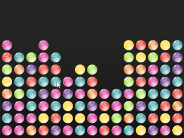

# NO LONGER MAINTAINED! #

Niekjah
======

Like many other bubble games, you pop groups of bubbles with the same colour.

Once upon a time, my best friend and now fiancé (long story ;-)) was stuck on a J2ME device and missed her favourite bubble games, so I suggested I’d make her one. Started out in Java with Swing to get the hang of the algorithm, this is placed on the “Swing” branch.  Then I started on the J2ME version, which is placed on the “J2ME” branch of this project.

Eventually I started playing around with the Android SDK and I figured why not try and port it over, so the Android branch contains a almost working copy. Enough of those games out there so I quit working on this, but feel free to improve.

 

